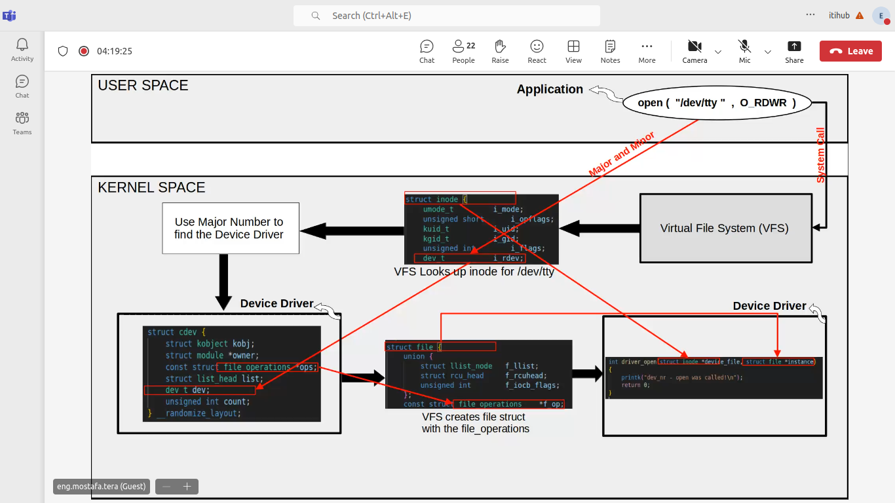

# device drivers 2

## make file (build system)
-	make -C /lib/modules/$(shell uname -r)/build M=$(PWD) modules
    - it will invoke make file in build and give it the path of .c file (M=)
    - the target will be modules

## in source code linux/drivers
- add directory for your driver (.c + Make file)
- then in Makefile inside drivers -> add the name of your directory

## char device 
- Each device in system -> ID 32 bit
    - Major -> 12 bits -> num of driver resposible 
    - Minor -> 20 bits -> num of device

1. create device file -> dev_t
2. allocate memroty(number) for this device
3. create entry under /sys/class -> class create
4. create entry under /dev  -> device create
5. register device in VFS (subsytem) -> cdev init + add
    - echo 1 > /dev/file ->>> system call(major , minor) -> VFS 
    - VFS -> (major -> driver1) + (minor -> device)
        - driver1_write(int minor);

    - VFS -> looks up for inode struct -> contains dev_t
    - use major num to use device driver (cdev -> object for our driver)
    - VFS create file struct with fops -> maps to file operation struct
    - VFS pass inode and file structs as paramters in open and close callbacks

